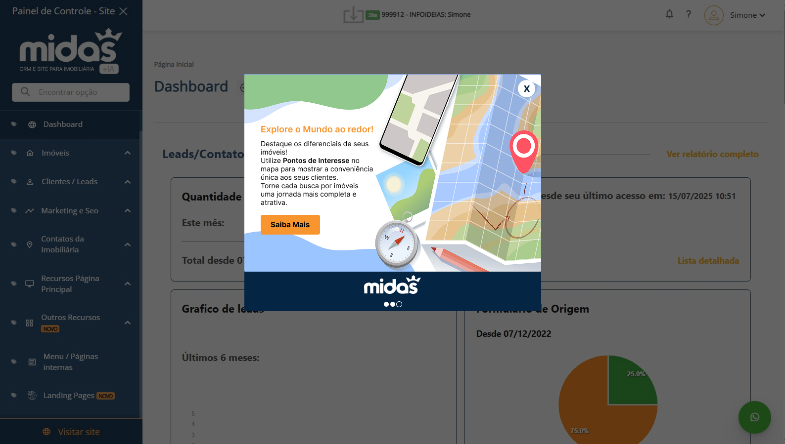
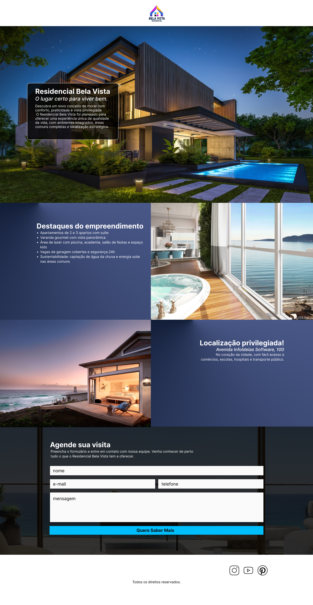

# teste-midas

## teste 01 - POP UP
### análise do original
- Em geral, texto em excesso (até no botão).
- Botão do "Clique para saber mais" com muito texto e extremamente decorado, dificultando a leitura.
- Botão de fechar o pop bem escondido. Além de o texto que segue o mesmo estar poluindo o pop up no topo.
- com o layout tendo o fundo branco, a segunda camada azul e aí sim a imagem com o conteúdo, ficaram várias "camadas" sem uso, apenas ocupando espaço

### solução
- Diminui o número de camadas e a quantidade de texto.
- Tornei o botão de "Saiba mais" algo mais minimalista, também removi os excessos além da imagem.
- Botão de fechar o pop up visualmente mais limpo.
  

## teste 02 - LANDING PAGE
### solução

.
